# Syntax of the tiger language

**prog:**

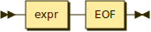

```ebnf
prog     ::= expr EOF
```

**dec:**

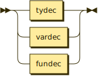

```ebnf
dec      ::= tydec
           | vardec
           | fundec
```

referenced by:

- letexp

**tid:**


```ebnf
tid      ::= ID
```

referenced by:

- fundec
- instOfArr
- instOfRec
- ty
- tydec
- tyfields
- vardec

**tydec:**

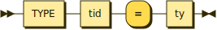

```ebnf
tydec    ::= TYPE tid '=' ty
```

referenced by:

- dec

**ty:**

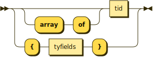

```ebnf
ty       ::= ( 'array' 'of' )? tid
           | '{' tyfields '}'
```

referenced by:

- tydec

**tyfields:**

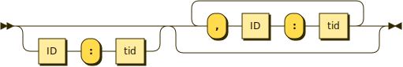

```ebnf
tyfields ::= ( ID ':' tid )? ( ',' ID ':' tid )*
```

referenced by:

- fundec
- ty

**vardec:**

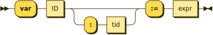

```ebnf
vardec   ::= 'var' ID ( ':' tid )? ':=' expr
```

referenced by:

- dec

**fundec:**

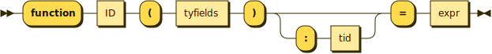

```ebnf
fundec   ::= 'function' ID '(' tyfields ')' ( ':' tid )? '=' expr
```

referenced by:

- dec

**expr:**

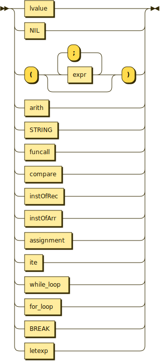

```ebnf
expr     ::= lvalue
           | NIL
           | '(' ( expr ( ';' expr )* )? ')'
           | arith
           | STRING
           | funcall
           | compare
           | instOfRec
           | instOfArr
           | assignment
           | ite
           | while_loop
           | for_loop
           | BREAK
           | letexp
```

referenced by:

- arith
- assignment
- compare
- expr
- for_loop
- funcall
- fundec
- instOfArr
- instOfRec
- ite
- letexp
- lvalue
- prog
- vardec
- while_loop

**letexp:**

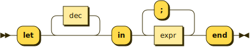

```ebnf
letexp   ::= 'let' dec* 'in' expr ( ';' expr )* 'end'
```

referenced by:

- expr

**while_loop:**

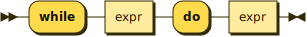

```ebnf
while_loop
         ::= 'while' expr 'do' expr
```

referenced by:

- expr

**for_loop:**


```ebnf
for_loop ::= 'for' ID ':=' expr 'to' expr 'do' expr
```

referenced by:

- expr

**ite:**

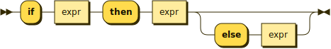

```ebnf
ite      ::= 'if' expr 'then' expr ( 'else' expr )?
```

referenced by:

- expr

**compare:**

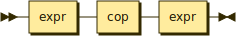

```ebnf
compare  ::= expr cop expr
```

referenced by:

- expr

**cop:**

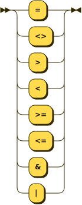

```ebnf
cop      ::= '='
           | '<>'
           | '>'
           | '<'
           | '>='
           | '<='
           | '&'
           | '|'
```

referenced by:

- compare

**assignment:**

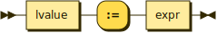

```ebnf
assignment
         ::= lvalue ':=' expr
```

referenced by:

- expr

**instOfRec:**

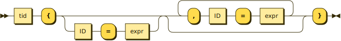

```ebnf
instOfRec
         ::= tid '{' ( ID '=' expr )? ( ',' ID '=' expr )* '}'
```

referenced by:

- expr

**funcall:**

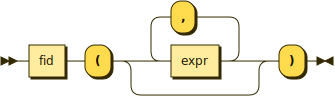

```ebnf
funcall  ::= fid '(' ( expr ( ',' expr )* )? ')'
```

referenced by:

- expr

**fid:**

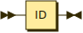

```ebnf
fid      ::= ID
```

referenced by:

- funcall

**arith:**


```ebnf
arith    ::= INT
           | ( expr ( '+' | '-' | '*' | '/' ) | '-' ) expr
```

referenced by:

- expr

**lvalue:**

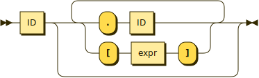

```ebnf
lvalue   ::= ID ( '.' ID | '[' expr ']' )*
```

referenced by:

- assignment
- expr

**instOfArr:**

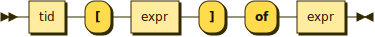

```ebnf
instOfArr
         ::= tid '[' expr ']' 'of' expr
```

referenced by:

- expr

<sup>
  <a href = "https://www.bottlecaps.de/rr/ui">generated by [RR - Railroad Diagram Generator]</a>
</sup>
